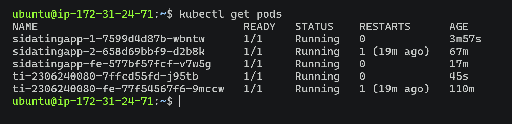
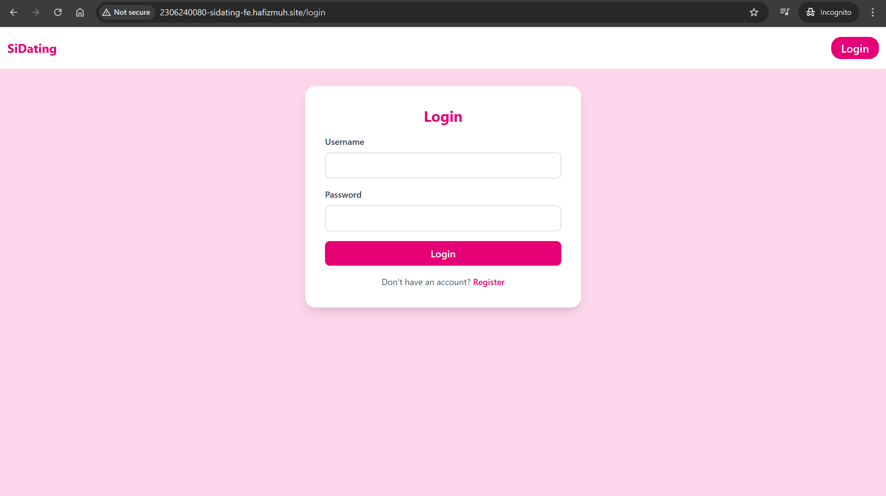
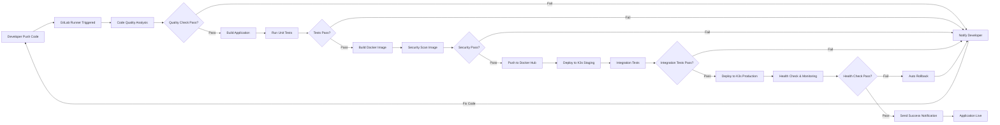

# Praktikum 9 - Deployment

## GitHub Link:
- https://github.com/HarmanHakim/sidatingapp-be-2306240080/
- https://github.com/HarmanHakim/sidatingapp-fe-2306240080/
- https://github.com/HarmanHakim/TI-BE-APAP-2306240080
- https://github.com/HarmanHakim/TI-FE-APAP-2306240080

## Jawaban README
### 1. Bukti Deployment
Screenshot Pods k3s:


#### Test Frontend
Screenshot Sidating FE:


### 3. Gambar Pipeline CI/CD Improvement + Penjelasan



**Deskripsi Improvement:**
Pipeline yang lebih lengkap mencakup:
- **Code Quality Analysis:** Deteksi bug dan anti-pattern sejak awal
- **Unit Testing:** Memastikan setiap komponen berfungsi dengan baik
- **Security Scan:** Mengidentifikasi vulnerability di image Docker
- **Staging Environment:** Testing di environment yang mirip production sebelum deploy
- **Integration Tests:** Memverifikasi komunikasi antar services
- **Health Check & Monitoring:** Memastikan aplikasi berjalan normal di production
- **Auto Rollback:** Jika deployment gagal, otomatis kembali ke versi sebelumnya
- **Notifikasi:** Inform tim tentang status setiap tahap

---

### 4. Mengapa instance dikaitkan dengan Elastic IP? Apa akibatnya jika tidak?

**Jawaban:**
Elastic IP memastikan alamat IP publik instance tetap sama meskipun instance dimatikan/di-restart. AWS Academy memiliki sesi yang terbatas (4 jam), dan setiap kali sesi dimulai ulang, IP publik akan berubah.

**Tanpa Elastic IP:**
- IP publik berubah setiap kali instance restart
- Domain yang sudah dikonfigurasi menjadi tidak valid/tidak mengarah ke instance baru
- Aplikasi yang sudah deployed tidak bisa diakses
- Perlu konfigurasi ulang setiap kali instance restart
- Konfigurasi Kubernetes dan database connection string menjadi tidak konsisten

**Dengan Elastic IP:**
- IP tetap konsisten untuk deployment yang reliable
- Domain selalu mengarah ke instance yang benar
- Tidak perlu rekonfigurasi setiap saat

---

### 5. Perbedaan utama Docker dan Kubernetes pada praktikum ini?

**Docker:**
- Container engine untuk membuat dan menjalankan aplikasi dalam isolated environment
- Menjalankan satu atau beberapa container secara individual
- Dependency management melalui Docker image dan docker-compose
- Cocok untuk development dan deployment sederhana

**Kubernetes (K3s):**
- Orchestration platform untuk mengelola banyak container secara otomatis
- Fitur: auto-scaling, self-healing, load balancing, rolling updates
- Mendistribusikan container di multiple nodes
- Mengelola networking, storage, dan resource allocation otomatis
- Cocok untuk production dan deployment skala besar

**Perbedaan pada praktikum:**
- Docker digunakan untuk containerize aplikasi Spring Boot dan Vue.js
- K3s digunakan untuk menjalankan, mengelola, dan mengakses container di production server
- Docker image di-push ke Docker Hub, kemudian K3s mengambil dan menjalankannya

---

### 6. Proses paling penting dalam pipeline dan alasannya?

**Jawaban: Deploy adalah proses paling penting**

Alasan:
- **Impact ke pengguna:** Build dan docker-push hanya menghasilkan artifact. Hanya deploy yang membuat aplikasi accessible untuk pengguna akhir
- **Delivery value:** Seluruh proses development hanya bernilai jika aplikasi berhasil sampai ke production
- **Production reliability:** Deploy memastikan versi aplikasi yang benar berjalan dengan konfigurasi yang tepat
- **Business continuity:** Jika deploy gagal, seluruh effort development menjadi sia-sia
- **Monitoring & validation:** Deploy stage memverifikasi aplikasi berjalan normal sebelum dianggap selesai

Tanpa deploy yang sukses, tidak ada yang mendapat manfaat dari code development.

---

### 7. Penjelasan kegunaan 5 file konfigurasi Kubernetes

**1. deployment.yaml**
- Mengatur bagaimana aplikasi dijalankan di cluster K3s
- Mendefinisikan: container image, jumlah replica, environment variables, resource limits (CPU/memory)
- Mengelola lifecycle pod: creation, update, dan deletion
- Memungkinkan rolling update untuk zero-downtime deployment

**2. service.yaml**
- Membuat endpoint stabil untuk mengakses pod
- Menggunakan ClusterIP untuk akses internal antar services
- Mengelola service discovery sehingga pod bisa saling berkomunikasi
- Menyediakan load balancing otomatis antar pod replica

**3. ingress.yaml**
- Mengatur routing trafik HTTP/HTTPS dari internet ke service di cluster
- Memetakan domain ke service yang sesuai
- Mengelola SSL/TLS termination untuk HTTPS
- Bertindak sebagai "gerbang depan" cluster yang terhubung dengan Traefik ingress controller

**4. secret.yaml** (dibuat di .gitlab-ci.yml)
- Menyimpan data sensitif: database password, JWT secret key, CORS origins
- Dienkripsi dan tidak ditampilkan di version control
- Diinjeksi ke pod sebagai environment variable pada saat deployment
- Memastikan kredensial aman dan tidak hardcoded di image

**5. config.yaml** (dibuat di .gitlab-ci.yml)
- Menyimpan konfigurasi non-sensitif: database URL, application name, feature flags
- Dipisahkan dari secret untuk easier management
- Memudahkan perubahan konfigurasi tanpa rebuild image
- Dinamis disesuaikan per environment (staging, production)

---

### 8. Sistem start on restart pada Docker/Kubernetes, di mana dan bagaimana diterapkan?

**Pada Docker:**
```bash
docker update --restart=always <container_name>
sudo systemctl enable docker
sudo systemctl start docker
```
- Policy `--restart=always` memastikan container otomatis restart jika crash atau server restart
- `systemctl enable docker` membuat Docker daemon autostart saat OS boot

**Pada Kubernetes:**
Kubernetes memiliki self-healing bawaan melalui Deployment controller:
```yaml
spec:
  replicas: 1
  selector:
    matchLabels:
      app: sidatingapp-1
  template:
    spec:
      containers:
      - name: springboot-container
        image: hafizmuh/sidatingapp-1:latest
        restartPolicy: Always
```
- `replicas: 1` memastikan ada 1 pod yang selalu berjalan
- Jika pod crash, Kubernetes otomatis membuat pod baru
- Jika server restart, K3s daemon otomatis menjalankan ulang semua pod sesuai deployment config
- `restartPolicy: Always` memastikan container restart otomatis jika gagal

**Kombinasi keduanya:**
1. Docker service di-enable agar start otomatis saat OS boot
2. Kubernetes daemon (k3s) berjalan sebagai docker container yang di-restart otomatis
3. Deployment spec di K3s menjalankan pod sesuai konfigurasi

---

### 9. Keuntungan menerapkan Kubernetes dibandingkan langsung run Docker image di server?

**Langsung run Docker image:**
- Manual management setiap container
- Tidak ada auto-scaling atau load balancing
- Jika container crash, harus restart manual
- Sulit untuk rolling update tanpa downtime
- Networking antar container rumit

**Dengan Kubernetes:**

1. **Orchestration Otomatis**
   - Kubernetes mengelola lifecycle semua container
   - Auto-restart jika container crash
   - Scheduling otomatis di mana container harus berjalan

2. **Scalability**
   - Mudah scale up/down dengan mengubah replicas
   - Horizontal Pod Autoscaler dapat auto-scale berdasarkan resource usage
   - Load balancing otomatis antar pod replica

3. **High Availability**
   - Self-healing: pod yang gagal otomatis di-recreate
   - Multi-replica memastikan service tetap berjalan meski ada pod yang down

4. **Rolling Updates**
   - Update aplikasi tanpa downtime
   - Kubernetes gradually mengganti pod lama dengan yang baru
   - Automatic rollback jika update gagal

5. **Resource Management**
   - Kubernetes mengoptimalkan penggunaan CPU dan memory
   - Mencegah resource overallocation atau waste
   - QoS (Quality of Service) untuk prioritas container

6. **Service Discovery & Networking**
   - Pod dapat saling komunikasi dengan DNS otomatis
   - Load balancing internal antar service
   - Network policies untuk security

7. **Configuration Management**
   - Centralized configuration dengan ConfigMap dan Secret
   - Environment variable management yang lebih baik
   - Mudah untuk multiple environments

8. **Monitoring & Logging**
   - Built-in health checks dan liveness probe
   - Easier integration dengan monitoring tools
   - Container logs terpusat

---

### 10. Perbedaan ClusterIP, NodePort, dan LoadBalancer? Kenapa pilih ClusterIP?

**ClusterIP (Internal Service)**
- Hanya accessible dari dalam cluster
- Setiap service mendapat IP virtual internal
- Pod dapat saling berkomunikasi melalui DNS: `<service-name>.<namespace>.svc.cluster.local`
- Default type jika tidak dispesifikasi
- Paling aman karena tidak exposed ke luar

**NodePort (External Access via Node)**
- Membuka port pada setiap node (physical machine) di cluster
- Port range: 30000-32767
- Accessible dari outside cluster melalui `<node-ip>:<nodeport>`
- Load balancing terjadi di node level
- Kurang flexible karena dependent pada node IP

**LoadBalancer (Cloud Integration)**
- Menggunakan external load balancer dari cloud provider (AWS ELB, GCP Load Balancer, etc.)
- Automatically provision external IP
- Best untuk production scale besar
- Lebih mahal karena menggunakan managed service
- Excellent for high traffic applications

**Perbandingan:**
| Aspek | ClusterIP | NodePort | LoadBalancer |
|-------|-----------|----------|--------------|
| Accessible dari luar | Tidak | Ya | Ya |
| Scope | Internal cluster | Internal + Node IP | External (cloud) |
| Use case | Service-to-service | Development, testing | Production |
| Security | Tinggi | Menengah | Rendah (exposed) |
| Cost | Gratis | Gratis | Berbayar |

**Kenapa pilih ClusterIP untuk praktikum ini?**

1. **Arsitektur praktikum:** 
   - Backend dan database hanya perlu diakses oleh services lain dan Ingress
   - Tidak perlu direct exposure ke node IP

2. **Security best practice:**
   - ClusterIP lebih aman karena hidden dari external network
   - Akses external hanya melalui Ingress yang sudah dikonfigurasi

3. **Ingress handling:**
   - Ingress sudah menangani routing eksternal ke service
   - Traefik Ingress Controller mengarahkan traffic domain ke ClusterIP service
   - ClusterIP + Ingress = secure dan clean architecture

4. **Resource efficiency:**
   - ClusterIP ringan dan tidak allocate external resources
   - Cocok untuk learning environment dengan resource terbatas (K3s di EC2 t2.medium)

5. **Best practice:**
   - Production applications menggunakan ClusterIP + Ingress + LoadBalancer (di layer Ingress)
   - Memisahkan service exposure dari application logic

---

### 11. Pelajaran terpenting dari deployment otomatis dan penerapan CI/CD di proyek lain?

**Pelajaran Terpenting:**

1. **Automation adalah kunci reliability**
   - Proses manual rentan human error
   - Automation membuat deployment konsisten dan reproducible
   - Setiap deployment sama persis regardless siapa yang menjalankan

2. **Fast feedback loop mempercepat development**
   - Dengan CI/CD, developer tahu dalam hitungan menit apakah code mereka bekerja
   - Bug terdeteksi lebih awal sebelum merge ke main
   - Development velocity meningkat

3. **Separation of concerns**
   - Development, testing, deployment adalah tahap terpisah yang jelas
   - Setiap tahap punya responsibility dan validation sendiri
   - Mudah untuk debug jika ada error

4. **Infrastructure as Code**
   - Konfigurasi deployment disimpan di repository bersama code
   - Versioning dan tracking changes lebih mudah
   - Reproducibility di environment apapun

5. **Containerization enable consistency**
   - "It works on my machine" problem solved
   - Development environment = production environment
   - Deployment lebih predictable

6. **Monitoring dan observability penting**
   - Deployment bukan akhir dari story
   - Health check dan logging memastikan aplikasi berjalan normal
   - Early warning untuk detect issues

**Penerapan di proyek lain:**

- **Microservices:** CI/CD ideal untuk managing multiple services independently
- **Mobile apps:** CD untuk continuous push updates ke app store
- **Infrastructure:** Infrastructure as Code dengan CI/CD untuk manage servers
- **Data pipelines:** CI/CD untuk ETL processes dan data quality checks
- **ML models:** CI/CD untuk training, validation, dan deployment models
- **Startup projects:** Rapid iteration dan deployment untuk market feedback

**Key takeaway:** CI/CD bukan hanya tentang automation teknis, tapi tentang building organizational capability untuk beriterasi cepat, berkualitas tinggi, dan reliable untuk mencapai business goals.

---

